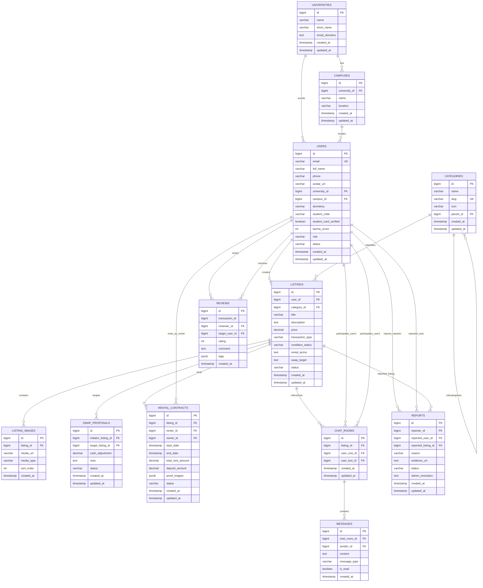

# THIẾT KẾ CƠ SỞ DỮ LIỆU (DATABASE ERD)
## DỰ ÁN: CAMPUS MARKETPLACE

Hệ quản trị cơ sở dữ liệu: **PostgreSQL 16+**

---

## 1. SƠ ĐỒ THỰC THỂ QUAN HỆ (MERMAID ERD)

```mermaid
erDiagram
    UNIVERSITIES ||--o{ CAMPUSES : has
    UNIVERSITIES ||--o{ USERS : enrolls
    CAMPUSES ||--o{ USERS : locates
    USERS ||--o{ LISTINGS : creates
    CATEGORIES ||--o{ LISTINGS : classifies
    CATEGORIES ||--o{ CATEGORIES : subcategories
    LISTINGS ||--o{ LISTING_IMAGES : contains
    LISTINGS ||--o{ SWAP_PROPOSALS : targets
    LISTINGS ||--o{ RENTAL_CONTRACTS : rents
    USERS ||--o{ RENTAL_CONTRACTS : rents_as_renter
    USERS ||--o{ REVIEWS : writes
    USERS ||--o{ REVIEWS : receives
    LISTINGS ||--o{ CHAT_ROOMS : references
    USERS ||--o{ CHAT_ROOMS : participates_user1
    USERS ||--o{ CHAT_ROOMS : participates_user2
    CHAT_ROOMS ||--o{ MESSAGES : contains
    USERS ||--o{ REPORTS : reports_reporter
    USERS ||--o{ REPORTS : reported_user
    LISTINGS ||--o{ REPORTS : reported_listing

    UNIVERSITIES {
        bigint id PK
        varchar name
        varchar short_name
        text email_domains
        timestamp created_at
        timestamp updated_at
    }

    CAMPUSES {
        bigint id PK
        bigint university_id FK
        varchar name
        varchar location
        timestamp created_at
        timestamp updated_at
    }

    USERS {
        bigint id PK
        varchar email UK
        varchar full_name
        varchar phone
        varchar avatar_url
        bigint university_id FK
        bigint campus_id FK
        varchar dormitory
        varchar student_code
        boolean student_card_verified
        int karma_score
        varchar role
        varchar status
        timestamp created_at
        timestamp updated_at
    }

    CATEGORIES {
        bigint id PK
        varchar name
        varchar slug UK
        varchar icon
        bigint parent_id FK
        timestamp created_at
        timestamp updated_at
    }

    LISTINGS {
        bigint id PK
        bigint user_id FK
        bigint category_id FK
        varchar title
        text description
        decimal price
        varchar transaction_type
        varchar condition_status
        text rental_terms
        text swap_target
        varchar status
        timestamp created_at
        timestamp updated_at
    }

    LISTING_IMAGES {
        bigint id PK
        bigint listing_id FK
        varchar media_url
        varchar media_type
        int sort_order
        timestamp created_at
    }

    SWAP_PROPOSALS {
        bigint id PK
        bigint initiator_listing_id FK
        bigint target_listing_id FK
        decimal cash_adjustment
        text note
        varchar status
        timestamp created_at
        timestamp updated_at
    }

    RENTAL_CONTRACTS {
        bigint id PK
        bigint listing_id FK
        bigint renter_id FK
        bigint owner_id FK
        timestamp start_date
        timestamp end_date
        decimal total_rent_amount
        decimal deposit_amount
        jsonb proof_images
        varchar status
        timestamp created_at
        timestamp updated_at
    }

    CHAT_ROOMS {
        bigint id PK
        bigint listing_id FK
        bigint user_one_id FK
        bigint user_two_id FK
        timestamp created_at
        timestamp updated_at
    }

    MESSAGES {
        bigint id PK
        bigint chat_room_id FK
        bigint sender_id FK
        text content
        varchar message_type
        boolean is_read
        timestamp created_at
    }

    REVIEWS {
        bigint id PK
        bigint transaction_id
        bigint reviewer_id FK
        bigint target_user_id FK
        int rating
        text comment
        jsonb tags
        timestamp created_at
    }

    REPORTS {
        bigint id PK
        bigint reporter_id FK
        bigint reported_user_id FK
        bigint reported_listing_id FK
        varchar reason
        text evidence_url
        varchar status
        text admin_resolution
        timestamp created_at
        timestamp updated_at
    }
```
